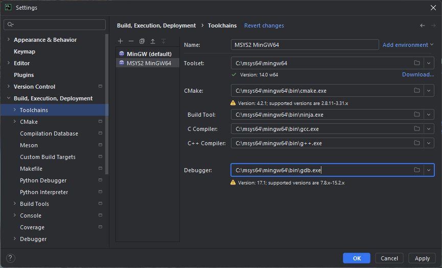
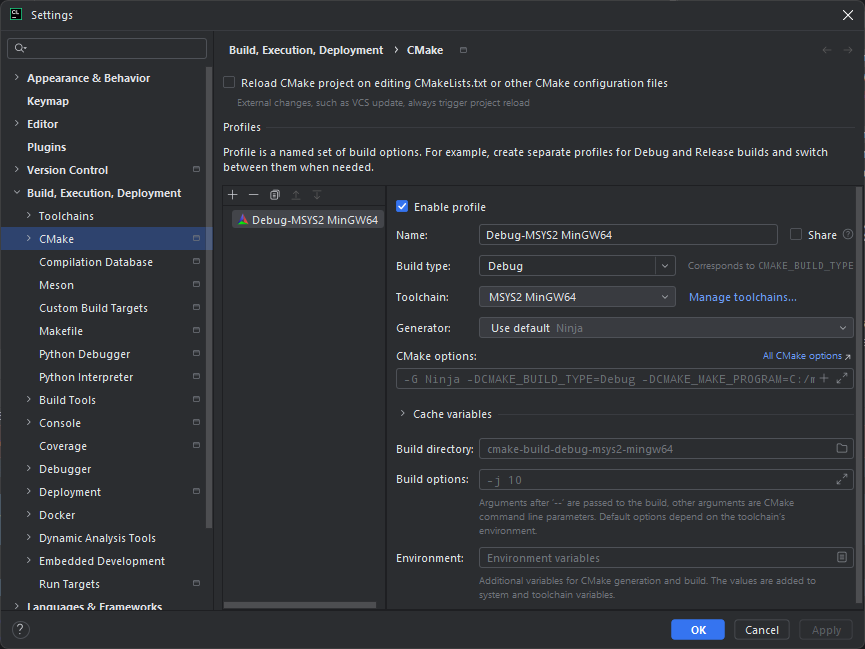

# Installation Guide

This document describes how to set up the development environment and build **SoundcardStrech**.

## 1. Windows (Recommended: Automated)

If you are on Windows, you can use the provided batch script to install all dependencies (MSYS2, MinGW, Libraries).

1.  Right-click `tool_install.bat` and select **Run as Administrator**.
2.  Follow the instructions in the terminal.
3.  The script will:
    *   Install MSYS2 and the MinGW64 toolchain.
    *   Install necessary libraries (`wxWidgets`, `PortAudio`, `RubberBand`).
4.  After the script finishes, follow the **IDE Configuration** section below.

---

## 2. Windows (Manual MSYS2 Method)

If the script fails or you prefer a manual setup:

1.  Download and install **MSYS2** from [msys2.org](https://www.msys2.org/).
2.  Open the **MSYS2 MinGW64** terminal.
3.  Run the following command to install the toolchain and dependencies:
```bash
pacman -Syu
pacman -S mingw-w64-x86_64-gcc mingw-w64-x86_64-gdb mingw-w64-x86_64-cmake mingw-w64-x86_64-ninja mingw-w64-x86_64-pkgconf
pacman -S mingw-w64-x86_64-portaudio mingw-w64-x86_64-libsndfile mingw-w64-x86_64-rubberband
pacman -S mingw-w64-x86_64-wxwidgets3.2-msw mingw-w64-x86_64-wxwidgets3.2-msw-libs mingw-w64-x86_64-wxwidgets3.2-common
```
4.  If this is done, follow the **IDE Configuration** section below.

---

## 3. Linux (Ubuntu / Debian / Fedora)

The project uses `pkg-config`, it is easy to build on Linux too.

### Ubuntu / Debian

```bash
sudo apt update sudo apt install build-essential cmake ninja-build pkg-config
libwxgtk3.2-dev libportaudio2 portaudio19-dev
librubberband-dev libsndfile1-dev
```

### Fedora

```bash
sudo dnf install gcc-c++ cmake ninja-build pkgconfig
wxGTK3-devel portaudio-devel
rubberband-devel libsndfile-devel
```

---

## 4. macOS (using Homebrew)

1.  Install **Homebrew** if not already present.
2.  Install dependencies:
    ```bash
    brew install cmake ninja pkg-config wxwidgets portaudio rubberband libsndfile
    ```
3.  If this is done, follow the **IDE Configuration** section below.

---

## 5. IDE Configuration (CLion)

Regardless of your OS, follow these steps to set up the project in CLion:

1.  **Open Project:** Open the `SoundcardStrech` folder in CLion.
2.  **Configure Toolchain:**
    *   Go to `File | Settings | Build, Execution, Deployment | Toolchains`.
    *   **Windows:** Add a new **MinGW** toolchain. Set the path to `C:\msys64\mingw64`.
    *   **Linux/macOS:** The default System toolchain should work.

    

3.  **CMake Profile:**
    *   Go to `File | Settings | Build, Execution, Deployment | CMake`.
    *   Ensure the "Toolchain" dropdown matches the one you just configured.
        
    

4.  **Build:** Click the hammer icon (Build) or the play button (Run).

## Note on wxWidgets

The current `CMakeLists.txt` is configured to download and build its own version of wxWidgets as an `ExternalProject`. 
*   **The first build will take significantly longer** because wxWidgets is being compiled from source. 
*   Ensure you have an active internet connection for the initial build.